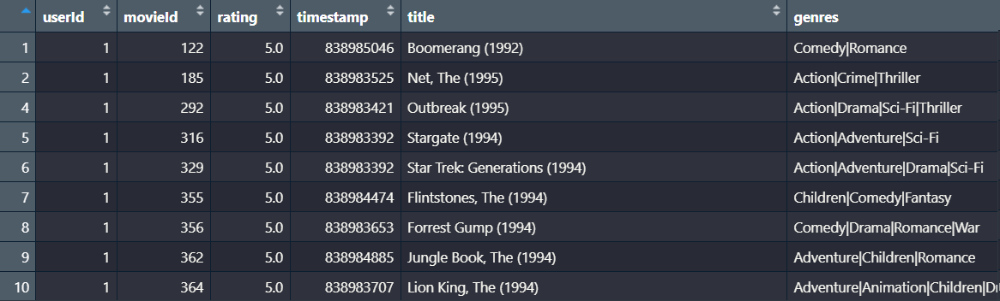
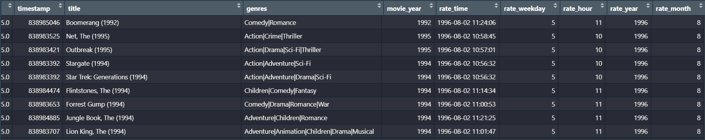
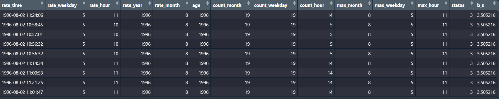
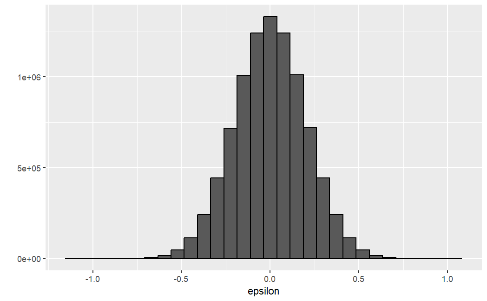
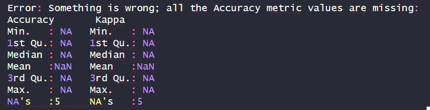
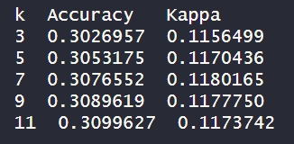

```{r setup, include=FALSE}
knitr::opts_chunk$set(echo = TRUE)
```


# Section 1. Introduction

The netflix movie rating dataset contains around 10,000,000 movie rating by users. The dataset can be downloaded using the following code.

```{r, eval=FALSE}
if(!require(tidyverse)) install.packages("tidyverse", repos = "http://cran.us.r-project.org")
if(!require(caret)) install.packages("caret", repos = "http://cran.us.r-project.org")

library(tidyverse)
library(caret)

# MovieLens 10M dataset:
# https://grouplens.org/datasets/movielens/10m/
# http://files.grouplens.org/datasets/movielens/ml-10m.zip

options(timeout = 120)

dl <- "ml-10M100K.zip"
if(!file.exists(dl))
  download.file("https://files.grouplens.org/datasets/movielens/ml-10m.zip", dl)

ratings_file <- "ml-10M100K/ratings.dat"
if(!file.exists(ratings_file))
  unzip(dl, ratings_file)

movies_file <- "ml-10M100K/movies.dat"
if(!file.exists(movies_file))
  unzip(dl, movies_file)

ratings <- as.data.frame(str_split(read_lines(ratings_file), fixed("::"), simplify = TRUE),
                         stringsAsFactors = FALSE)
colnames(ratings) <- c("userId", "movieId", "rating", "timestamp")
ratings <- ratings %>%
  mutate(userId = as.integer(userId),
         movieId = as.integer(movieId),
         rating = as.numeric(rating),
         timestamp = as.integer(timestamp))

movies <- as.data.frame(str_split(read_lines(movies_file), fixed("::"), simplify = TRUE),
                        stringsAsFactors = FALSE)
colnames(movies) <- c("movieId", "title", "genres")
movies <- movies %>%
  mutate(movieId = as.integer(movieId))

movielens <- left_join(ratings, movies, by = "movieId")

# Final hold-out test set will be 10% of MovieLens data
set.seed(1, sample.kind="Rounding") # if using R 3.6 or later
# set.seed(1) # if using R 3.5 or earlier
test_index <- createDataPartition(y = movielens$rating, times = 1, p = 0.1, list = FALSE)
edx <- movielens[-test_index,]
temp <- movielens[test_index,]

# Make sure userId and movieId in final hold-out test set are also in edx set
final_holdout_test <- temp %>% 
  semi_join(edx, by = "movieId") %>%
  semi_join(edx, by = "userId")

# Add rows removed from final hold-out test set back into edx set
removed <- anti_join(temp, final_holdout_test)
edx <- rbind(edx, removed)

```

In above code, we split the whole dataset to two parts: "edx", and "final_holdout_test".
The final_holdout_test contains 10% of the original dataset, which is used for testing models/algorithms. The edx part takes the remaining dataset and is used for training.

One can view the first 10 rows of the dataset edx.




# Section 2. Analysis


The columns of the dataset include "userId", "movieId", "rating", "timestamp", "title", and "genres". To build our own model, we will add more columns to the dataset. The new columns are based on the column "timestamp". We analyze them in the following subsections.

## Subsection 2.1. Brief of our model

To build a recommender system, one must focus on the columns "timestamp", "title" and "genres". The title of a movie provides hints about the contents. The same is true for the genres of a movie. In this project, we will not study in this direction.

Instead, we will focus on the timestamp and the year the movie was made to create a recommender system. The timestamp shows when a user rated and watched a movie. There are
some patterns involved. For instance, if a user watched movies mostly in the summer and also december, then that user is more likely a student. Similarly, if a user watched movies during week days from 9:00am - 4:00pm, then she is more likely a housewife. If a user wacthed most movies during weekends, then he/she is more likely a worker. Further, the earliset movie rating indicates the user's age. For instance, if a user submitted a review in 1991, then that user is more likely to be 2025-1991 + 15 = 49 year olds. 

The year of the movie was made also contains some information. A user is more likely to watch movies of his/her generations. Hence we will define a movie is recent to a user, if it is made around 10 years of his age. Otherwise, that movie is considered to be "Good Old", "Old" or "Really Old".

## Subsection 2.2. The dataset edx is first preprocessed in the following steps.

1. Step 1: Convert the timestamp to the "Year-Month_Day Hour:Minute:Second" format, and
            then extract the rate_year, rate_month, rate_day, rate_hour information.                Mutate edx to add new columns and rename it to edx1, which will be used for
            further processing. The movie_year column is also added. It is extracted 
            from the title column using a regex.
            
    ```{r, eval=FALSE}
    library(lubridate)
    
    edx1<- edx%>%
      mutate(movie_year= as.numeric(str_extract(str_extract(title, "\\(\\d+\\)$"), "\\d+")),
             rate_time = as_datetime(timestamp, origin="1970-01-01", tz="UTC"),
             rate_weekday = wday(rate_time,  week_start=1),
             rate_hour = hour(rate_time),
             rate_year = year(rate_time),
             rate_month = month(rate_time))
    
    head(edx1, n=10)
    ```
            
 


2. Step 2: Estimate the age of a user based on the earlist rating by that user. The column "age" is added to edx1.
 
    ```{r, eval=FALSE}
    
    edx1<- edx1 %>%
        group_by(userId) %>%
       # filter(row_number()%in% 1:10) %>%
        mutate(age=min(rate_year))
    
    ```
             
 
 
 
3. Step 3: The month, weekday and hour when a user matched all movies are calculated using the following code.
           
    ```{r, eval=FALSE}
            edx1<- edx1 %>%
              mutate(age=min(rate_year)) %>%
              group_by(userId, rate_month) %>%
              mutate(count_month=n()) %>%
              ungroup() %>%
              group_by(userId, rate_weekday) %>%
              mutate(count_weekday = n()) %>%
              ungroup() %>%
              group_by(userId, rate_hour) %>%
              mutate(count_hour=n()) %>%
              ungroup() %>%
              group_by(userId) %>%
              mutate(max_month= rate_month[which.max(count_month)],
                     max_weekday = rate_weekday[which.max(count_weekday)],
                     max_hour = rate_hour[which.max(count_hour)]) %>%
              ungroup()#
            
              print(edx1, n=50)
    ```
  
  Then, users are classified as either 1 (as "Student"), 2 (as "worker"), 3 (as "House Wife") and 4 (as "General"). A column called "status" is added. 
         
  
         
         
  Further, the paramter $b_s$ is calculated, which is the average of rating of all movies rated by one of the four status. 
        
    ```{r, eval=FALSE}
    
    edx1<- edx1 %>%
      mutate(status=case_when(
        max_month == 6                          ~ 1, # "Student"
        max_weekday %in% c("Sat", "Sun")        ~ 2, # "Worker",
        max_hour %in% c(9,10,11,12,13,14,15,16) ~ 3, #"House Wife",
        TRUE                                    ~ 4 #"General"
      )) %>%
      #select(userId, rate_time, count_weekday, max_weekday, count_hour, max_hour, status)
      group_by(status) %>%
      mutate(b_s = mean(rating))
    
    ```
 
 
4. Step 4: The column age_r is added, which has value 1 (as "Recent"), 2 (as "Good old"), 3 (as "Old"), 4 (as "Really Old"). Further, the aeverage $b_{sa}$ is calculated, which is the average of $rating- b_s$ for each age_r category inside each user status classification. 
         
    ```{r, eval=FALSE}
    current_year<- year(Sys.Date())
    current_year
    edx1<- edx1 %>%
      mutate(age_r = case_when(
        movie_year <= current_year - 10 ~ 1, #"Recent",
        abs(movie_year - age)<= 10      ~ 2, #"Good Old",
        movie_year <= (age - 20)        ~ 3, #"Old",
        TRUE                            ~ 4, #"Really Old"
      ))%>%
      group_by(status, age) %>%
      mutate(b_sa = mean(rating - b_s))%>%
      ungroup()
    
    print(edx1, n=10)
    ```
         


# Section 3. Results

## Subsection 3.1. The models

### The proposed model in the course lecture is the following.
 $$Y_{u,i} = \mu + b_i + b_u +\epsilon_{u,i}$$
 where,
 
  $\mu$            -- the average rating of all movies by all users
  
  $b_i$           -- the average rating of the movie i by all users
  
  $b_u$           -- the average rating of all movies by user $u$
  
  $epsilon_{u,i}$ -- the random difference by user u and movie $i$.


 
### Our new model will be the following

 $$Y_{u,i} = b_s + b_sa + \epsilon_{u,i}$$
  where,
  
  $b_s$         -- the average rating of all movies of rated by users of status $s$
  
  $b_{sa}$     -- the average rating of all movies of rated by users of status $s$ and   age category $a$
     

### We can use the following code to calculate the RMSE.

```{r, eval=FALSE}
RMSE <- function(true_ratings, predicted_ratings){
  sqrt(mean((true_ratings - predicted_ratings)^2))
}

```

## Subsection 3.2. The $\epsilon_{u,i}$

For the $\epsilon_{u,i}$, we use the following code to generate a random variable with normal distribution. In the function $rnorm(n, 0, 1/5)$, we use the standard deviation to be 1/5 instead of 1, since our rating is a number between 0 and 5. 99% of the random values fall in 3 standard deviation. To be sure that $\epsilon_{u,i}$ contains only small numbers that are less than 1, we will have a standard deviation sd such that $3*sd \leq 1$. We choose $sd=1/5$. 
  
```{r echo=TRUE, include=TRUE, eval=FALSE}
n<- nrow(edx1)
set.seed(1)
epsilon<-  rnorm(n, 0, 1/5)
qplot(epsilon, bins = 30, color = I("black"))

```
  
  


  
## Subsection 3.3. Calculating $RMSE$

We calculate $RMSE$ for two models. 
   
### For $Y_{u,i} = b_s + \epsilon_{u,i}$, we run the following code.

```{r, echo=TRUE, eval=FALSE}

model1_rmse <- RMSE(edx1$b_s + epsilon, edx1$rating)
model1_rmse

model1_rmse_e <- RMSE(edx1$b_s, edx1$rating)
model1_rmse_e
```

When running, we obtaint

model1_rmse = 1.079119

model1_rmse_e = 1.060317


### For $Y_{u,i} = b_s + b_sa + \epsilon_{u,i}$, we run this code.
  
```{r, echo=TRUE, eval=FALSE}
model2_rmse <- RMSE(edx1$b_s+edx1$b_sa+epsilon, edx1$rating)
model2_rmse

model2_rmse <- RMSE(edx1$b_s+edx1$b_sa, edx1$rating)
model2_rmse

```
  
  When running above code, we obtain
  
  model2_rmse   = 1.077446
  
  model2_rmse_e = 1.058619
  
  
  
## Subsection 3.4. Using KNN and Random Forest algorithms.

To train the data using either KNN or Random Forest algorithms, we have to select certain columns as predictors. 

we tried several combinations. Most combinations do not work well with those algorithms. They do work well when the subset the training dataset to be small, such as 20,000 rows. When the number of rows grows bigger, it will produce the following error message.




Above error mainly comes from the structure of the dataset, where they are so many similar data values. 

The following is a summary of some of our experiments.

### Combination 1 for KNN

  Code:
  
    ```{r, eval=FALSE}
     x<- edx1 %>%select(max_month, max_weekday, max_hour,movie_year, age, status, age_r)
      y<-factor(edx1$rating)
      x1<- x[1:20200,]
      y1<- y[1:20200]
    
      control <- trainControl(method = "boot", number = 5, p = .3)
      set.seed(1, sample.kind = "Rounding")
      train_knn <- train(x1, y1,
                       method = "knn", 
                       tuneGrid = data.frame(k = c(3,5,7,9,11)),
                       trControl = control)
      train_knn
    
    ```
      

 
  Result: , k=11, accuracy=0.3102587, kappa = 0.1178905, run time = 30 minutes


### Combination 2 for KNN

  Code:
    ```{r, eval=FALSE}
      x<- edx1 select(max_month, max_weekday, max_hour,movie_year, age)
    
      y<-factor(edx1$rating)
      x1<- x[1:20200,]
      y1<- y[1:20200]
    
      control <- trainControl(method = "boot", number = 5, p = .3)
    
      set.seed(1, sample.kind = "Rounding")
      train_knn <- train(x1, y1,
                       method = "knn", 
                       tuneGrid = data.frame(k = c(3,5,7,9,11)),
                       trControl = control)
      train_knn
    
    ```
      

  Result: k=11, accuray = 0.3099627, kappa = 0.1173742, run time = 20 minutes
  


### Combination 3 for KNN

  Code:
    ```{r, eval=FALSE}
     x<- edx1 select(max_month, max_weekday, max_hour,movie_year, age)
    
      y<-factor(edx1$rating)
      x1<- x[1:20300,]
      y1<- y[1:20300]
    
      control <- trainControl(method = "boot", number = 5, p = .3)
    
      set.seed(1, sample.kind = "Rounding")
      train_knn <- train(x1, y1,
                       method = "knn", 
                       tuneGrid = data.frame(k = c(3,5,7,9,11)),
                       trControl = control)
      train_knn
    
    ```
      
 
  Result: 
  
  
  


### combination 4 for KNN 

    Code:
```{r, eval=FALSE}
    
    train_index <- createDataPartition(y = edx1$rating, times = 1, p = 0.5, list = FALSE)
    
    edx2 <- edx1[train_index,]
    x2<- edx2 %>% select(max_month, max_weekday, max_hour,movie_year, age, b_s, b_sa)
    y2<- factor(edx2$rating)
    
    control <- trainControl(method = "boot", number = 5, p = .3)
    set.seed(1, sample.kind = "Rounding")
    train_knn <- train(x2, y2,
                   method = "knn", 
                   tuneGrid = data.frame(k = c(3,5,7,9,11)),
                   trControl = control)
    train_knn

```

  Result: run time: 7 hours

  The code run about 7 hours. Finally it produces results. The accuracy is around 0.308. The best value of 
  k is 11. 
  
  One can see the picture below for more information.
  
  


$\vspace{0.3in}$

### Combination 1 for Random Forest

  Code:
    ```{r, eval=FALSE}
     set.seed(1, sample.kind = "Rounding")
      train_index <- createDataPartition(y = edx1$rating, times = 1, p = 0.1, list = FALSE)
      edx2b <- edx1[train_index,]
    
      x2<- edx2b %>% select(max_month, max_weekday, max_hour,movie_year, age, b_s, b_sa)
      y2<- factor(edx2b$rating)
    
      control <- trainControl(method="cv", number = 5, p=0.3)
      grid <- data.frame(mtry = c(1, 5, 10, 25, 50, 100))
      train_rf <-  train(x2, y2,
                       method = "rf",
                       nTree = 150,
                       trControl = control,
                       tuneGrid = grid,
                       nSamp = 5000)
      train_rf
    
    ```
      
     
  Result: Error as above

### Combination 2 for Random Forest

  Code: 
    ```{r, eval=FALSE}
      set.seed(1, sample.kind = "Rounding")
      train_index <- createDataPartition(y = edx1$rating, times = 1, p = 0.1, list = FALSE)
      edx2b <- edx1[train_index,]
    
      x2<- edx2b %>% select(max_month, max_weekday, max_hour,movie_year, age)
      y2<- factor(edx2b$rating)
    
      control <- trainControl(method="cv", number = 5, p=0.3)
      grid <- data.frame(mtry = c(1, 5, 10, 25, 50, 100))
      train_rf <-  train(x2, y2,
                       method = "rf",
                       nTree = 150,
                       trControl = control,
                       tuneGrid = grid,
                       nSamp = 5000)
      train_rf
    ```
      


  Result:   Error as above.
  
  run time: 2 hours
  
### Combination 3 for Random Forest

 Code: 
    ```{r, eval=FALSE}
     
      set.seed(1, sample.kind = "Rounding")
      train_index <- createDataPartition(y = edx1$rating, times = 1, p = 0.1, list = FALSE)
      edx2b <- edx1[train_index,]
    
      x2<- edx2b %>% select(max_month, max_weekday, max_hour,movie_year, age, b_s, b_sa)
      y2<- factor(edx2b$rating)
    
      control <- trainControl(method="cv", number = 5, p=0.3)
      grid <- data.frame(mtry = c(1, 5, 10, 25, 50, 100))
      train_rf <-  train(x2, y2,
                       method = "rf",
                       nTree = 150,
                       trControl = control,
                       tuneGrid = grid,
                       nSamp = 5000)
      train_rf
    ```
     

  Result:  Error as above. 
  
  run time: 12 hours
  


# Section 4. Conclusion

We use our model and then KNN algorithm to estimate the RMSE. 

## Subsection 4.1. Using the model 

$$Y_{u,i} = b_s + b_sa + \epsilon_{u,i}$$
on the test dataset final_holdout_test, we will follow the same steps as in processing the training dataset edx1.

### Step 1: Convert timestamp and add rate year, month, weekday information.
            
    ```{r, eval=FALSE}
    library(lubridate)
    
    edx1<- final_holdout_test%>%
      mutate(movie_year= as.numeric(str_extract(str_extract(title, "\\(\\d+\\)$"), "\\d+")),
             rate_time = as_datetime(timestamp, origin="1970-01-01", tz="UTC"),
             rate_weekday = wday(rate_time,  week_start=1),
             rate_hour = hour(rate_time),
             rate_year = year(rate_time),
             rate_month = month(rate_time))
    
    head(edx1, n=10)
    ```
                


### Step 2: Estimate the age of a user based on the earlist rating by that user. 
 
    ```{r, eval=FALSE}
    
    edx1<- edx1 %>%
        group_by(userId) %>%
       # filter(row_number()%in% 1:10) %>%
        mutate(age=min(rate_year))
    
    
    ```
     
 
 
 
### Step 3: The month, weekday and hour when a user watched all movies are calculated using the following code.
 
    ```{r, eval=FALSE}
    edx1<- edx1 %>%
      mutate(age=min(rate_year)) %>%
      group_by(userId, rate_month) %>%
      mutate(count_month=n()) %>%
      ungroup() %>%
      group_by(userId, rate_weekday) %>%
      mutate(count_weekday = n()) %>%
      ungroup() %>%
      group_by(userId, rate_hour) %>%
      mutate(count_hour=n()) %>%
      ungroup() %>%
      group_by(userId) %>%
      mutate(max_month= rate_month[which.max(count_month)],
             max_weekday = rate_weekday[which.max(count_weekday)],
             max_hour = rate_hour[which.max(count_hour)]) %>%
      ungroup()#
    
    
      edx1<- edx1 %>%
      mutate(status=case_when(
        max_month == 6                          ~ 1, # "Student"
        max_weekday %in% c("Sat", "Sun")        ~ 2, # "Worker",
        max_hour %in% c(9,10,11,12,13,14,15,16) ~ 3, #"House Wife",
        TRUE                                    ~ 4 #"General"
      )) %>%
      #select(userId, rate_time, count_weekday, max_weekday, count_hour, max_hour, status)
      group_by(status) %>%
      mutate(b_s = mean(rating))

    ```

 
### Step 4: Other columns 
 
    ```{r, eval=FALSE}
    current_year<- year(Sys.Date())
    current_year
    edx1<- edx1 %>%
      mutate(age_r = case_when(
        movie_year <= current_year - 10 ~ 1, #"Recent",
        abs(movie_year - age)<= 10      ~ 2, #"Good Old",
        movie_year <= (age - 20)        ~ 3, #"Old",
        TRUE                            ~ 4, #"Really Old"
      ))%>%
      group_by(status, age) %>%
      mutate(b_sa = mean(rating - b_s))%>%
      ungroup()
    ```
     
### <u>Step 5: Calculate the RMSE</u>

    ```{r, eval=FALSE}
    RMSE <- function(true_ratings, predicted_ratings){
      sqrt(mean((true_ratings - predicted_ratings)^2))
    }

    n<- nrow(edx1)
    set.seed(1)
    epsilon<-  rnorm(n, 0, 1/5)
    qplot(epsilon, bins = 30, color = I("black"))

    
    model1_rmse_e <- RMSE(edx1$b_s + epsilon, edx1$rating)
    model1_rmse_e
    
    model1_rmse <- RMSE(edx1$b_s, edx1$rating)
    model1_rmse
    
    
    model2_rmse_e <- RMSE(edx1$b_s+edx1$b_sa+epsilon, edx1$rating)
    model2_rmse_e
    
    model2_rmse <- RMSE(edx1$b_s+edx1$b_sa, edx1$rating)
    model2_rmse
    
        
    ```
When running above two models, our final RMSEs are the following.

   model1_rmse_e = 1.080017
   
   model1_rmse   = 1.061187   
   
   model2_rmse_e = 1.078398
   
   model2_rmse   = 1.059531
   
   
   

## Subsection 4.2. Using the KNN algorithm on the test dataset.

  I am supposed to use the trained model "train_knn" obtained from the dataset edx. However, the R-studio restarted and I lost the paramters for "train_knn". Since it takes about 7 hours to retrain the dataset edx, I will just go ahead train it using final_holdout_test dataset to retrain it, since the size of the dataset is much smaller. It shall take much less time. 
  
  
    ```{r, echo=TRUE, eval=FALSE}
        
        x2<- edx1 %>% select(max_month, max_weekday, max_hour,movie_year, age, b_s, b_sa)
        y2<- factor(edx1$rating)
        
        control <- trainControl(method = "boot", number = 5, p = .3)
        set.seed(1, sample.kind = "Rounding")
        train_knn <- train(x2, y2,
                       method = "knn", 
                       tuneGrid = data.frame(k = c(3,5,7,9,11)),
                       trControl = control)
        train_knn
        
        knn_preds <- predict(train_knn, x2)
        
        class(y2)
        class(knn_preds)

        knn_preds_number<- as.numeric(as.character(knn_preds))
        y2_number <- as.numeric(as.character(y2))

        RMSE(knn_preds, y_2)
      
    ```

\begin{verbatim}   
Run time: 30 hours 
    
k-Nearest Neighbors 

999999 samples
     7 predictor
    10 classes: '0.5', '1', '1.5', '2', '2.5', '3', '3.5', '4', '4.5', '5' 

No pre-processing
Resampling: Bootstrapped (5 reps) 
Summary of sample sizes: 999999, 999999, 999999, 999999, 999999 
Resampling results across tuning parameters:

   k   Accuracy   Kappa     
   3  0.2524361  0.07007906
   5  0.2570716  0.07020484
   7  0.2612519  0.07053776
   9  0.2644661  0.07044062
  11  0.2672463  0.07057714

Accuracy was used to select the optimal model using the largest value.
The final value used for the model was k = 11.

> RMSE(knn_preds_number, y2_number)
[1] 1.159398

\end{verbatim}
  
  Our final RMSE is 1.159398 when using knn algorithm.
    
    
# Reference

1. https://www.rdocumentation.org/

2. https://statisticsglobe.com/warning-message-ops-factor-not-meaningful-in-r